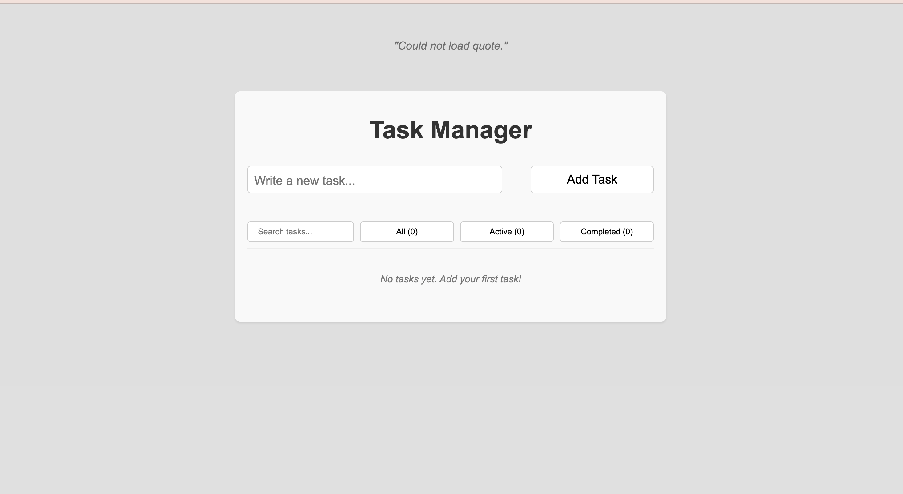
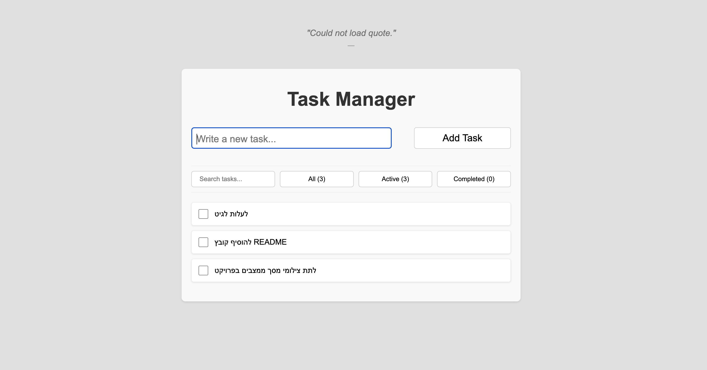
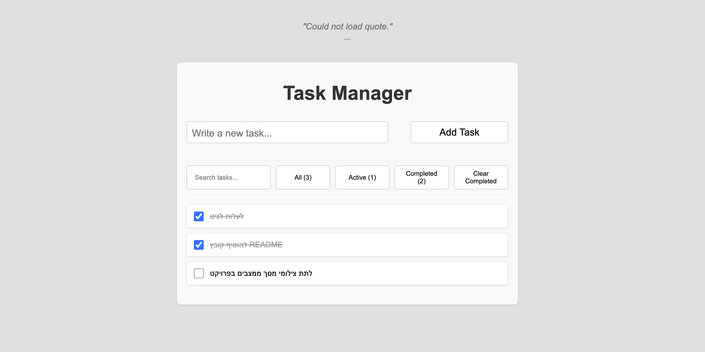
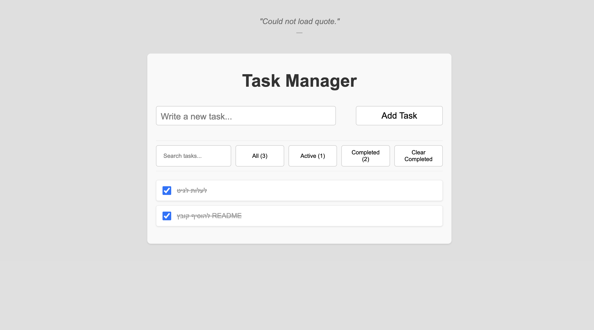
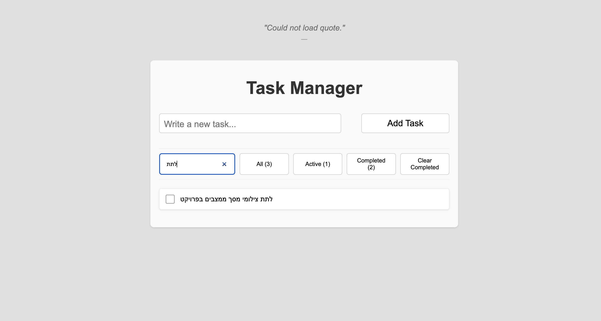
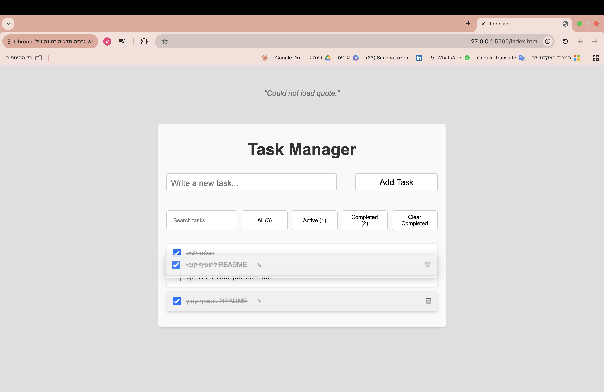
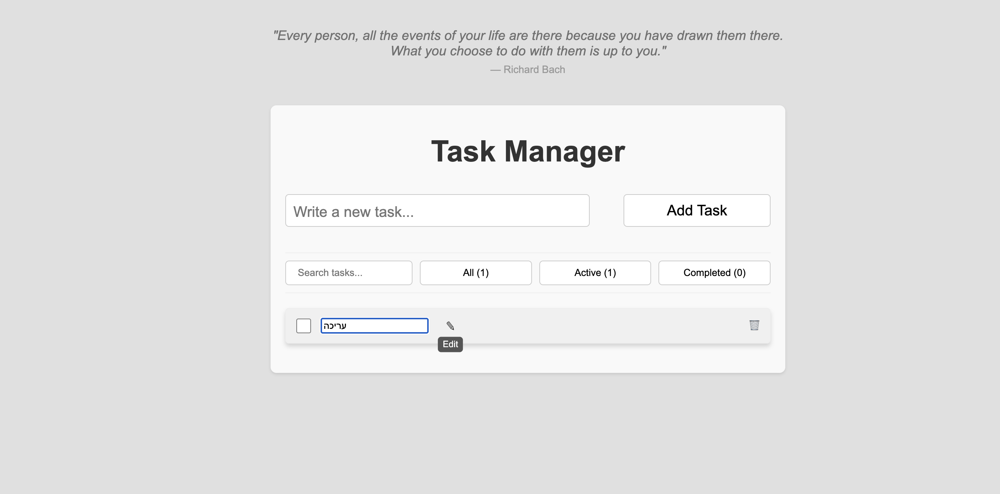
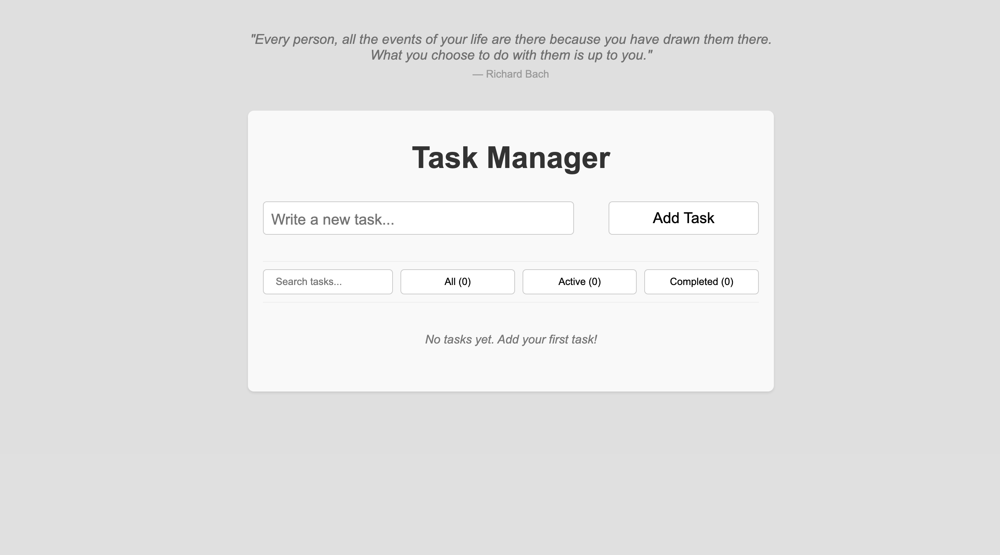

# 📝 Advanced Todo App

A modern and feature-rich Todo application built with **Vanilla JavaScript**, **HTML**, and **CSS**.

This project demonstrates clean architecture, state management, DOM manipulation, drag-and-drop interactions, and persistent storage using LocalStorage.

---

## 🚀 Features

- Add tasks
- Delete tasks
- Edit tasks inline
- Mark tasks as completed
- Clear completed tasks
- Filter tasks (All / Active / Completed)
- Search tasks with debounce
- Drag & Drop task reordering
- Persistent storage using LocalStorage
- Daily motivational quote from API
- Quote caching per day
- Empty state UI
- Smooth animations
- Tooltips on actions

---

## 📸 Screenshots

### Empty State

### Adding Tasks

### Completed Task

### Filtering Tasks

### Search Tasks

### Drag and Drop Reordering

### Edit Task Inline

### Daily Quote

---

## 🛠 Technologies Used

- HTML5
- CSS3
- JavaScript (ES6 Modules)
- LocalStorage API
- Fetch API
- Drag and Drop API

---

## 📂 Project Structure
todo-app/
│
├── index.html
├── css/
│ └── style.css
│
├── src/
│ ├── main.js
│ ├── TodoApp.js
│ ├── TaskManager.js
│ ├── Task.js
│ └── QuoteService.js
│
└── screenshots/

---

## ▶️ How to Run

1. Clone the repository
git clone https://github.com/simcharozenvaser/todo-app.git

2. Open the project folder

3. Run:
open index.html

No installation required.

---

## 💡 Architecture Highlights

- Object-oriented design
- Separation of concerns
- Event-driven UI
- Persistent state management
- Debounced search
- Modular ES6 structure

---

## 🎯 Purpose

This project was built to practice:

- DOM manipulation
- JavaScript modules
- Clean code architecture
- UI/UX design
- State persistence
- Drag and Drop interactions

---

## 👨‍💻 Author

Simcha Rozenvaser
